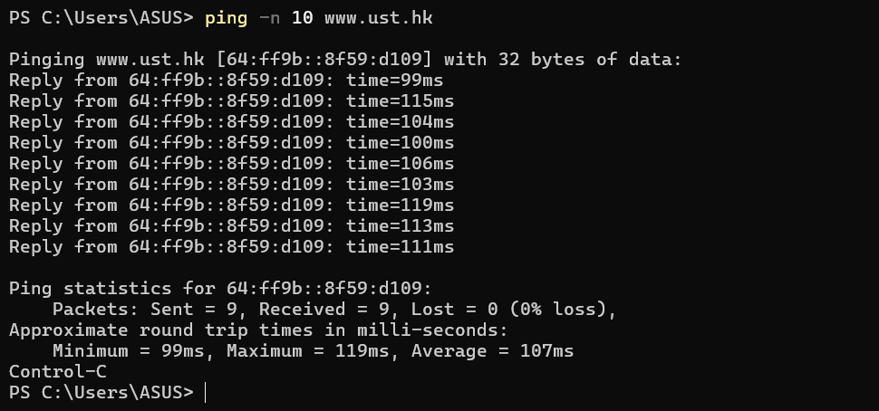
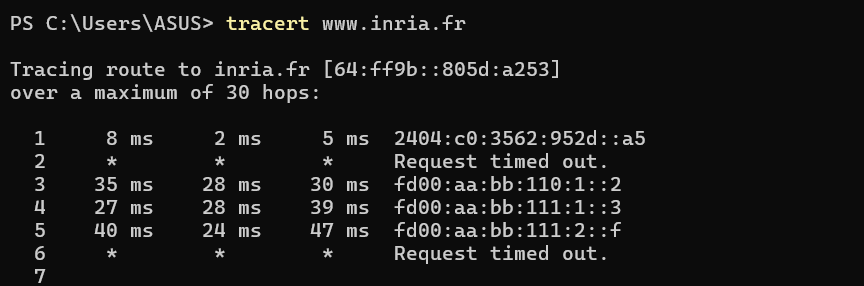

# Tugas Praktikum Week 12 | Internet Control Message Protocol (ICMP) & Asistensi Tugas Besar

Nama : Galang Herjuno Mulya  
NIM : 103072430006  
Kelas : IF-04-01

---

## Struktur Folder

1. `Assets/` berisi screenshot hasil `ping` dan `tracert`.

---

## Tujuan Praktikum

Mahasiswa dapat memahami format dan fungsi pesan ICMP, mengamati perbedaan antara Echo Request dan Echo Reply, serta melihat bagaimana pesan ICMP digunakan pada proses traceroute.

---

## Pengantar

Pada praktikum ini, saya mengeksplorasi protokol ICMP melalui dua pengujian utama, yaitu `ping` dan `tracert`. Selain itu, modul ini juga mencakup dokumentasi progress dan asistensi tugas besar sebagai bagian dari pelaporan praktikum.

---

## Langkah Percobaan

1. Jalankan perintah `ping` ke server target.
2. Jalankan perintah `tracert` untuk melihat jalur hop.
3. Buka hasil capture atau output command line untuk dianalisis.

---

## Output / Hasil Percobaan

### Verifikasi Keaktifan Host Menggunakan Ping
 

### Pelacakan Jalur Jaringan Menggunakan Tracert
 

---

## Analisis ICMP

### 1. Echo Request dan Echo Reply
Pada packet ICMP Echo Request, host mengirim pesan untuk mengecek apakah target masih aktif. Jika target merespons, maka akan muncul Echo Reply. Dari sini kita bisa menghitung RTT atau waktu bolak-balik paket.

### 2. Struktur Header ICMP
Header ICMP umumnya berisi field seperti Type, Code, Checksum, Identifier, dan Sequence Number. Payload di dalamnya berfungsi membawa data tambahan untuk membandingkan request dan reply.

### 3. ICMP pada Traceroute
Traceroute memanfaatkan ICMP untuk mengetahui router mana saja yang dilewati paket. Ketika TTL habis di tengah jalan, router akan mengirim pesan ICMP Time Exceeded kembali ke pengirim.

### 4. Paket Balasan dari Hop Pertama
Pesan ICMP dari hop pertama menunjukkan bahwa paket probe awal tidak sampai ke tujuan karena TTL sudah habis. Pesan balasan ini membantu menunjukkan urutan jalur yang ditempuh paket.

---

## Pertanyaan Modul

### Bagian 1: ICMP dan Ping

1. **Berapa alamat IP sumber (Source IP) dan alamat IP tujuan (Destination IP) pada datagram IP yang membungkus paket ICMP Echo Request pertama Anda?**
   - **Jawaban:** Source IP adalah alamat IP komputer lokal, sedangkan Destination IP adalah alamat IP server tujuan yang diping.

2. **Periksa field tipe (Type) dan kode (Code) dari pesan ICMP Echo Request tersebut! Berapa nilai numerik yang tertera?**
   - **Jawaban:** Untuk Echo Request, nilai Type adalah **8** dan Code adalah **0**.

3. **Sebutkan field-field apa saja yang menyusun struktur header paket ICMP tersebut seperti Checksum, Identifier, dll! Berapa byte ukuran muatan data (payload) bawaannya?**
   - **Jawaban:** Field ICMP umumnya terdiri dari **Type, Code, Checksum, Identifier, Sequence Number**, dan payload data. Ukuran payload bawaan bergantung pada aplikasi `ping`, tetapi secara umum cukup besar untuk membawa data uji dan perbandingan RTT.

4. **Sekarang periksa paket ICMP Echo Reply pasangannya. Berapa nilai field tipe (Type) dan kode (Code) pada pesan balasan tersebut?**
   - **Jawaban:** Untuk Echo Reply, nilai Type adalah **0** dan Code adalah **0**.

### Bagian 2: ICMP dan Traceroute

5. **Cari paket kesalahan ICMP yang dikembalikan ke komputer Anda oleh router hop pertama. Field tipe (Type) dan kode (Code) apa yang tertera pada pesan kesalahan tersebut? Mengapa router mengirimkan pesan kesalahan tersebut kembali ke komputer Anda?**
   - **Jawaban:** Pesan yang umum muncul adalah **Time Exceeded** dengan Type **11** dan Code **0**. Router mengirimkannya karena TTL paket probe sudah habis sebelum mencapai tujuan akhir.

6. **Periksa jendela detail paket pada pesan kesalahan ICMP tersebut. Dapatkah Anda melihat bahwa paket data tersebut ikut membungkus kembali salinan header datagram IP asli yang sebelumnya dikirim oleh komputer Anda? Jelaskan tujuan dari perilaku tersebut!**
   - **Jawaban:** Ya, pesan ICMP error biasanya menyertakan cuplikan header IP asli agar host pengirim tahu paket mana yang gagal dan di titik mana kegagalan terjadi.

7. **Periksa tiga paket probe ICMP terakhir yang dikirim oleh komputer Anda menuju host tujuan akhir. Apakah paket-paket terakhir tersebut masih menerima pesan kesalahan ICMP, atau menerima jenis pesan yang lain? Jelaskan analisis Anda!**
   - **Jawaban:** Jika paket berhasil mencapai tujuan akhir, respons yang diterima adalah Echo Reply, bukan Time Exceeded. Pada tahap akhir traceroute, balasan berubah karena paket tidak lagi habis TTL di router perantara.

---

## Progress dan Asistensi Tugas Besar

Pada bagian ini, saya mendokumentasikan progress pengerjaan tugas besar serta log asistensi yang dilakukan selama praktikum. Dokumentasi ini berguna sebagai bukti bahwa pengerjaan proyek berjalan sesuai tahapan yang diminta.

---

## Kesimpulan

Berdasarkan praktikum ini, ICMP berperan penting untuk verifikasi host melalui ping dan untuk pelacakan jalur jaringan melalui traceroute. Selain itu, dokumentasi progress tugas besar membantu menunjukkan perkembangan pengerjaan proyek secara terstruktur.

## Ends Of File
 [Kembali ke Halaman Utama](../README.md) 
