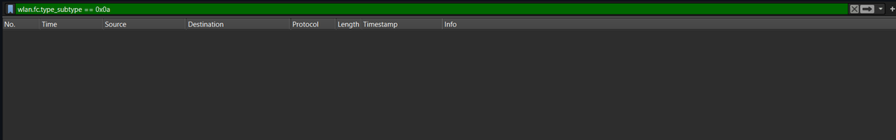

# Tugas Praktikum Week 14 | Jaringan Nirkabel 802.11 (WiFi)

Nama : Galang Herjuno Mulya  
NIM : 103072430006  
Kelas : IF-04-01

---

## Struktur Folder

1. `Assets/` berisi screenshot beacon frame, association, dan disassociation pada jaringan WiFi.

---

## Tujuan Praktikum

Mahasiswa dapat memahami cara kerja jaringan nirkabel 802.11 melalui analisis beacon frame, proses association, dan disassociation di Wireshark.

---

## Pengantar

Pada praktikum ini, saya mengamati karakteristik jaringan nirkabel IEEE 802.11 atau WiFi. Fokus pengamatan ada pada beacon frame yang dipancarkan access point, lalu dilanjutkan dengan proses association, response, dan disassociation untuk melihat bagaimana perangkat berkomunikasi dengan access point.

---

## Langkah Percobaan

1. Buka Wireshark dan filter paket WiFi yang relevan.
2. Amati beacon frame dari access point.
3. Perhatikan paket association request dan association response.
4. Amati paket disassociation untuk melihat proses pemutusan koneksi.

---

## Output / Hasil Percobaan

### Analisis Beacon Frame
 

### Association Request
 

### Association Response
 

### Disassociation
 

---

## Analisis 802.11

### 1. Beacon Frame
Beacon frame dikirim secara periodik oleh access point untuk menyiarkan keberadaan SSID dan parameter jaringan. Dari frame ini, perangkat client dapat mengetahui bahwa jaringan WiFi tersedia.

### 2. Association Request dan Response
Association request dikirim oleh client ketika ingin bergabung ke jaringan WiFi. Access point kemudian merespons dengan association response untuk menyetujui atau menolak permintaan tersebut.

### 3. Disassociation
Disassociation menunjukkan bahwa koneksi nirkabel diputus, baik dari sisi client maupun access point. Frame ini menandai bahwa perangkat tidak lagi aktif terhubung ke jaringan tersebut.

### 4. Parameter Jaringan
Selain SSID, beacon frame biasanya membawa informasi lain seperti beacon interval, supported rates, dan capability information. Informasi ini membantu client menentukan apakah access point cocok untuk digunakan.

---

## Pertanyaan Modul

1. **Apa nama SSID dari Access Point yang memancarkan paket Beacon Frame yang Anda pilih?**
   - **Jawaban:** SSID dari access point terlihat pada beacon frame yang diamati di Wireshark dan digunakan sebagai identitas jaringan WiFi.

2. **Berapa interval waktu (Beacon Interval) yang digunakan oleh Access Point tersebut?**
   - **Jawaban:** Beacon interval adalah nilai yang tercantum pada detail beacon frame, biasanya dalam satuan TU.

3. **Periksa bagian field Capability Information pada Beacon Frame tersebut. Fitur keamanan atau privasi apa yang diaktifkan oleh Access Point tersebut?**
   - **Jawaban:** Dari capability information, access point dapat diketahui apakah menggunakan fitur keamanan seperti WEP, WPA2, atau WPA3.

4. **Selain SSID, sebutkan minimal 3 parameter informasi lain yang ikut disisipkan di dalam muatan paket Beacon Frame tersebut!**
   - **Jawaban:** Parameter lain yang umum muncul adalah supported rates, HT capabilities, dan information element lain yang mendukung identifikasi jaringan.

5. **Cari sebuah frame data nirkabel (Data Frame). Apakah alamat MAC Sumber (Source MAC) dan alamat MAC Tujuan (Destination MAC) pada layer nirkabel ini sama dengan alamat IP klien dan server pada layer di atasnya? Jelaskan konsep alamat Transmitter (TA) dan Receiver (RA) pada 802.11!**
   - **Jawaban:** Tidak selalu sama. Pada 802.11, alamat MAC layer nirkabel mewakili transmitter dan receiver di link radio, sedangkan alamat IP dipakai di layer yang lebih tinggi untuk identitas end-to-end.

---

## Progres Akhir Aplikasi Tugas Besar

Bagian ini mendokumentasikan progres akhir aplikasi client-server dan proses validasi sebelum presentasi tugas besar. Dokumentasi ini menjadi bukti bahwa pengerjaan sudah sampai pada tahap pengujian akhir.

---

## Kesimpulan

Berdasarkan praktikum ini, jaringan WiFi dapat dianalisis melalui beacon frame, association, dan disassociation. Wireshark membantu memperlihatkan bagaimana access point menyiarkan identitas jaringan dan bagaimana client masuk serta keluar dari jaringan tersebut.

## Ends Of File
 [Kembali ke Halaman Utama](../README.md) 
