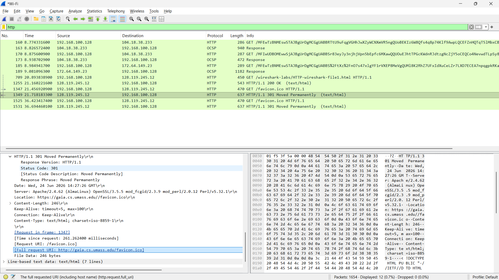
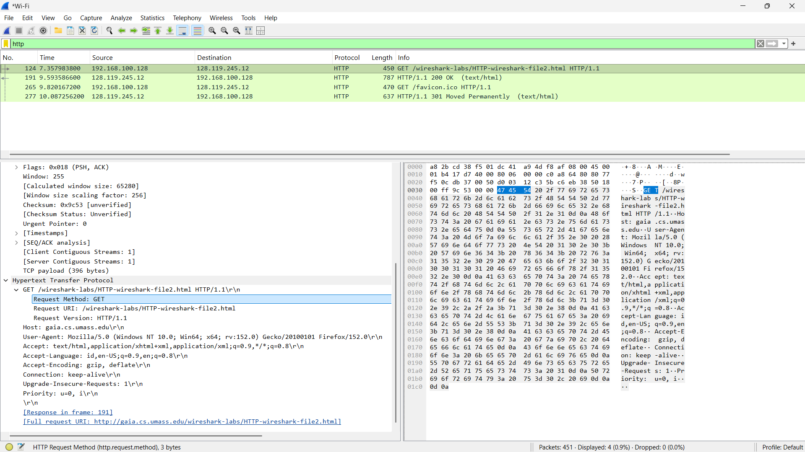
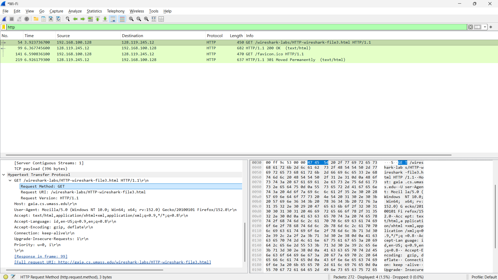
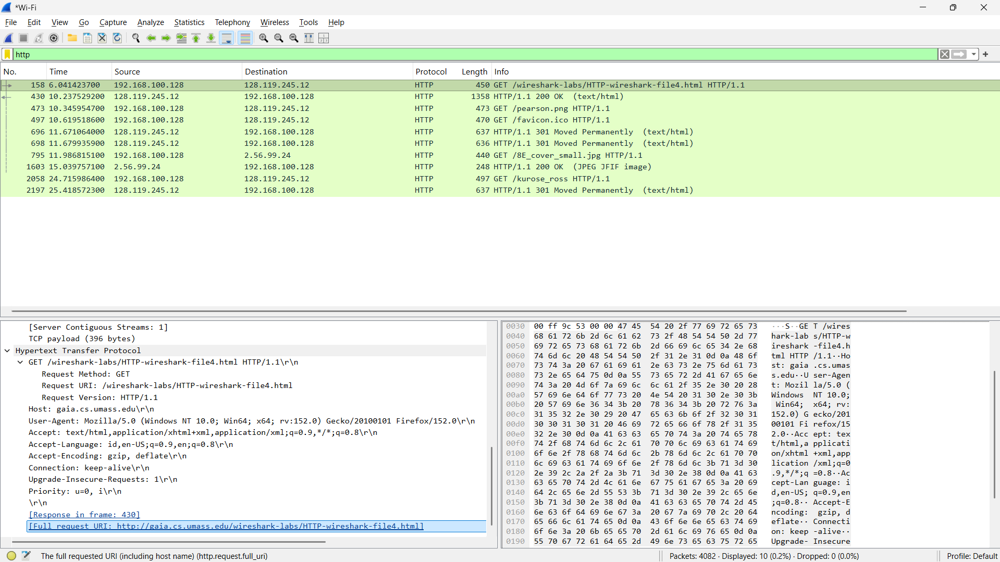
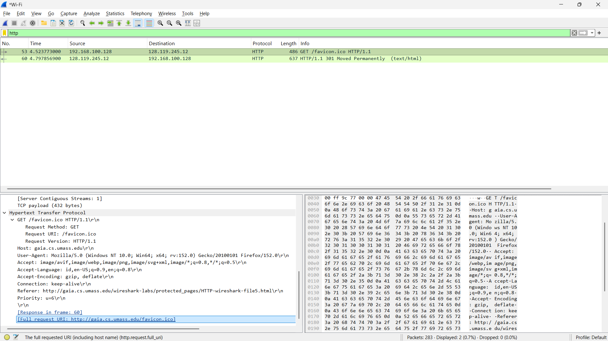

# Tugas Praktikkum Week 3 | Protokol HTTP

Nama : Galang Herjuno Mulya  
NIM : 103072430006  
Kelas : IF-04-01

---

## Struktur Folder

1. `Assets/` berisi screenshot hasil analisis HTTP di Wireshark.

---

## Tujuan Praktikum

Mahasiswa dapat memahami cara kerja HTTP melalui observasi request dan response pada Wireshark.

---

## Pengantar

Praktikum week 3 membahas cara kerja protokol HTTP melalui pengamatan langsung di Wireshark. Disini saya fokus melihat bagaimana browser dan server saling bertukar request dan response, serta bagaimana header HTTP memengaruhi proses pengambilan data.

---

## Output / Hasil Percobaan

### 1. Persiapan Filter Wireshark
#### Tampilan Filter HTTP
 

### 2. Basic HTTP GET/Response Interaction
#### Tampilan Traffic HTTP GET dan Response OK
 

### 3. HTTP Conditional GET/Response Interaction
#### Tampilan Traffic Conditional GET
 

### 4. Mengambil Dokumen HTML yang Panjang
#### Tampilan Paket Terfragmentasi
 

### 5. Dokumen HTML dengan Embedded Objects
#### Tampilan Traffic Embedded Objects
 

---

## Analisis Singkat

HTTP berjalan di atas koneksi TCP dan digunakan untuk pertukaran data web antara client dan server. Pada praktikum ini, saya melihat request GET, response 200 OK, conditional GET, transfer dokumen panjang, dan pemuatan embedded objects.

---

## Kesimpulan

Berdasarkan hasil pengamatan, HTTP dapat dianalisis dengan cukup jelas melalui Wireshark karena setiap request dan response menampilkan alur komunikasi yang terstruktur.

## Ends Of File
 [Kembali ke Halaman Utama](../README.md) 
