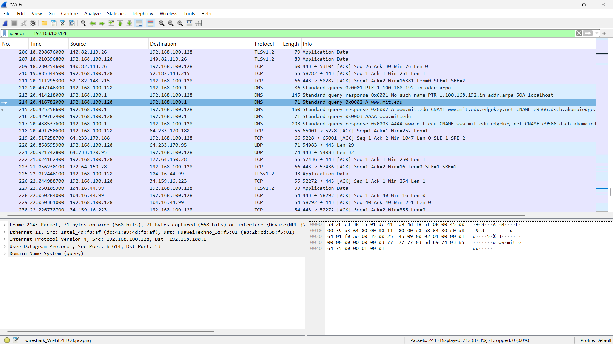
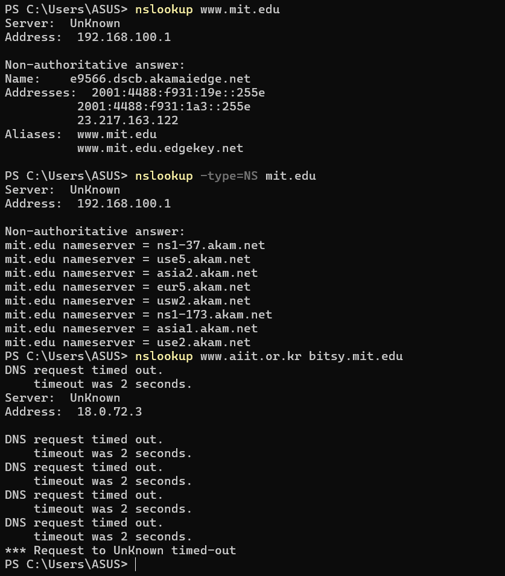
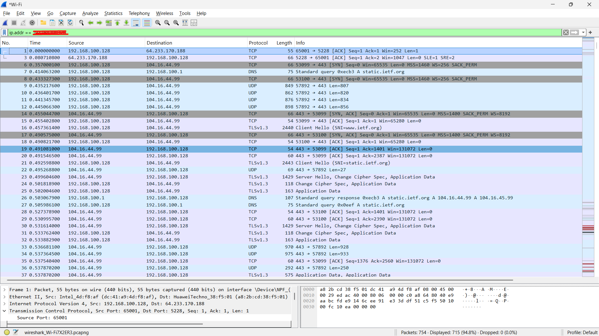
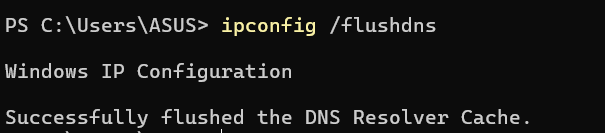
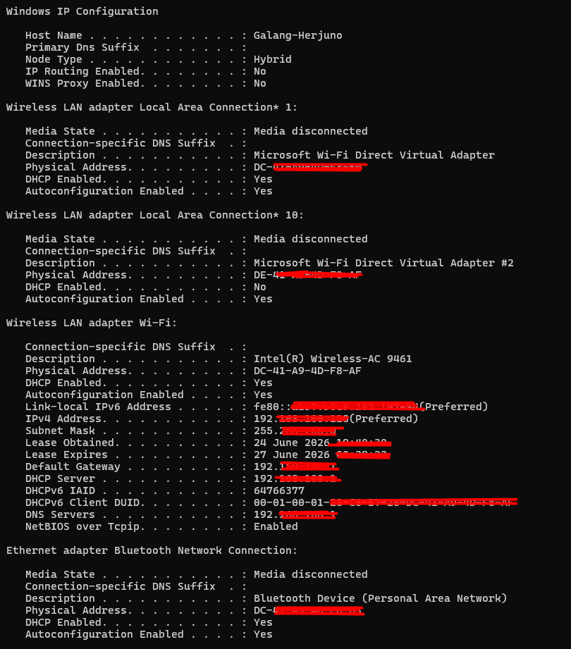

# Tugas Praktikkum Week 4 | Domain Name System (DNS)

Nama : Galang Herjuno Mulya  
NIM : 103072430006  
Kelas : IF - 04 - 01

---

## Struktur Folder

1. `Assets/` berisi screenshot hasil analisis DNS di Wireshark.

---

## Tujuan Praktikum

Mahasiswa dapat memahami fungsi DNS dalam menerjemahkan nama domain menjadi alamat IP serta membaca traffic DNS pada Wireshark.

---

## Pengantar

Praktikum week 4 membahas cara kerja Domain Name System atau DNS. Pada modul ini saya melakukan beberapa percobaan menggunakan `nslookup`, melihat cache DNS lokal, lalu mengamati traffic DNS di Wireshark untuk memahami alur query dan response.

---

## Output / Hasil Percobaan

### 1. Uji Coba Perintah Nslookup Dasar
#### Tampilan Command Prompt Nslookup MIT
 

### 2. Mencari DNS Otoritatif dengan Opsi Type NS
#### Tampilan Query DNS Otoritatif
 

### 3. Query DNS Spesifik ke Server Tertentu
#### Tampilan Query ke Server Spesifik
 

### 4. Melihat dan Mengosongkan Cache DNS Lokal
#### Tampilan Proses Flush DNS
 

### 5. Tracing Paket DNS Melalui Wireshark
#### Tampilan Paket DNS Query dan Response
 

---

## Pertanyaan Modul

1. **Cari pesan permintaan DNS dan balasannya. Apakah pesan tersebut dikirimkan melalui UDP atau TCP?**
   - **Jawaban:** Pada praktik umum DNS seperti ini, pesan permintaan dan balasan DNS dikirim melalui **UDP**.

2. **Apa port tujuan pada pesan permintaan DNS? Apa port sumber pada pesan balasannya?**
   - **Jawaban:** Port tujuan pada pesan permintaan DNS adalah **53**. Port sumber pada pesan balasan adalah **53** juga.

3. **Pada pesan permintaan DNS, apa alamat IP tujuannya? Apa alamat IP server DNS lokal Anda? Apakah kedua alamat IP tersebut sama?**
   - **Jawaban:** Alamat IP tujuan pada pesan permintaan DNS adalah alamat server DNS yang digunakan oleh komputer.

4. **Periksa pesan permintaan DNS. Apa jenis atau type dari pesan tersebut? Apakah pesan permintaan tersebut mengandung jawaban atau answers?**
   - **Jawaban:** Type yang paling umum adalah **A** untuk mencari alamat IPv4. Pesan permintaan tidak mengandung answers.

5. **Periksa pesan balasan DNS. Berapa banyak jawaban atau answers yang terdapat di dalamnya? Apa saja isi yang terkandung dalam setiap jawaban tersebut?**
   - **Jawaban:** Jumlah answers bergantung pada domain yang diminta. Biasanya balasan berisi record A/CNAME.

6. **Perhatikan paket TCP SYN yang selanjutnya dikirimkan oleh host Anda. Apakah alamat IP pada paket tersebut sesuai dengan alamat IP yang tertera pada pesan balasan DNS?**
   - **Jawaban:** Ya, alamat IP pada paket TCP SYN umumnya sesuai dengan alamat IP hasil balasan DNS.

7. **Halaman web yang sebelumnya Anda akses memuat beberapa gambar. Apakah host Anda perlu mengirimkan pesan permintaan DNS baru setiap kali ingin mengakses suatu gambar?**
   - **Jawaban:** Tidak selalu. Jika gambar masih berada pada domain yang sama, host biasanya tidak perlu melakukan query DNS baru karena alamat IP server sudah diketahui dan sering disimpan di cache.

---

## Kesimpulan

Berdasarkan praktikum ini, DNS terbukti berperan penting dalam menerjemahkan nama domain ke alamat IP dan dapat diamati jelas melalui Wireshark.

## Ends Of File
 [Kembali ke Halaman Utama](../README.md) 
