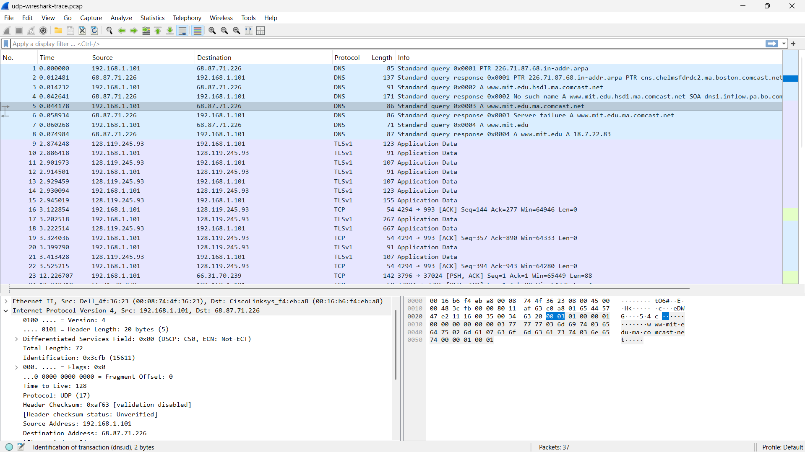
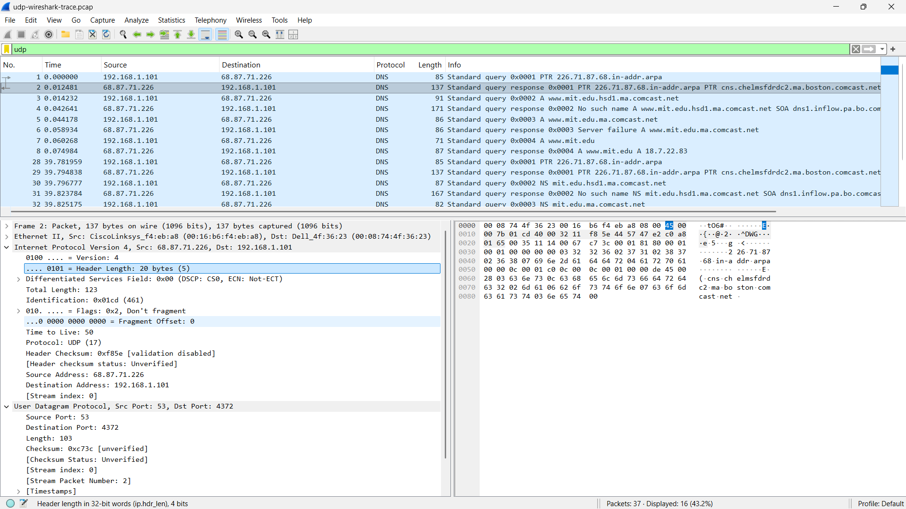

# Tugas Praktikkum Week 5 | User Datagram Protocol (UDP)

Praktikum week 5 membahas protokol UDP. Pada modul ini saya memfilter traffic UDP di Wireshark, lalu melihat detail header dari salah satu paket UDP untuk memahami struktur datagram yang digunakan.

### 1. Filter dan Pemilihan Paket UDP
Langkah pertama yang dilakukan adalah membuka Wireshark, lalu memfilter traffic dengan keyword `udp`. Setelah itu, saya memilih salah satu paket UDP untuk melihat isi header pada bagian packet details.

#### Tampilan Traffic UDP dan Perluasan Bidang Header
 

### 2. Analisis Header UDP
Dari paket UDP yang dipilih, terlihat bahwa header UDP hanya memiliki empat field utama, yaitu Source Port, Destination Port, Length, dan Checksum. Struktur yang sederhana ini membuat UDP lebih ringan dibandingkan TCP karena tidak memiliki mekanisme koneksi yang kompleks.

#### Tampilan Detail Header UDP
 

### Pertanyaan Modul

1. **Pilih satu paket UDP yang terdapat pada trace Anda. Dari paket tersebut, berapa banyak field yang terdapat pada header UDP? Sebutkan nama-nama field yang Anda temukan!**
   - **Jawaban:** Header UDP memiliki **4 field**, yaitu **Source Port**, **Destination Port**, **Length**, dan **Checksum**.

2. **Perhatikan informasi content field pada paket yang Anda pilih di pertanyaan 1. Berapa panjang (dalam satuan byte) masing-masing field yang terdapat pada header UDP?**
   - **Jawaban:** Masing-masing field pada header UDP memiliki panjang tetap. Source Port = **2 byte**, Destination Port = **2 byte**, Length = **2 byte**, dan Checksum = **2 byte**.

3. **Nilai yang tertera pada Length menyatakan nilai apa? Verifikasi jawaban Anda melalui paket UDP pada trace.**
   - **Jawaban:** Field **Length** menyatakan total panjang segmen UDP, yaitu **header UDP + data payload**. Jadi, angka ini bukan hanya ukuran payload, tetapi keseluruhan datagram UDP.

4. **Berapa jumlah maksimum byte yang dapat disertakan dalam payload UDP?**
   - **Jawaban:** Karena field Length berukuran 16 bit, ukuran maksimum UDP adalah **65535 byte**. Setelah dikurangi header UDP sebesar 8 byte, payload maksimum UDP adalah **65527 byte**.

5. **Berapa nomor port terbesar yang dapat menjadi port sumber?**
   - **Jawaban:** Nomor port terbesar adalah **65535**, karena field port pada UDP memakai 16 bit.

6. **Berapa nomor protokol untuk UDP? Berikan jawaban Anda dalam notasi heksadesimal dan desimal.**
   - **Jawaban:** Nomor protokol UDP adalah **0x11** dalam heksadesimal, atau **17** dalam desimal.

7. **Periksa pasangan paket UDP di mana host Anda mengirimkan paket UDP pertama dan paket UDP kedua merupakan balasan dari paket UDP yang pertama. Jelaskan hubungan antara nomor port pada kedua paket tersebut!**
   - **Jawaban:** Pada pasangan request dan reply, **port sumber pada paket pertama akan menjadi port tujuan pada paket balasan**, sedangkan **port tujuan pada paket pertama akan menjadi port sumber pada paket balasan**. Hubungannya saling terbalik karena balasan dikirim kembali ke pengirim awal.

## Ends Of File
 [Kembali ke Halaman Utama](../README.md) 
