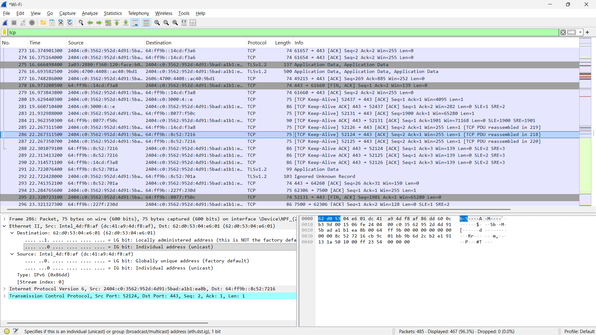

# Tugas Praktikkum Week 6 | Transmission Control Protocol (TCP)

Praktikum week 6 membahas cara kerja protokol TCP melalui proses upload file ke server `gaia.cs.umass.edu`. Pada modul ini saya melihat bagaimana koneksi TCP dibentuk, bagaimana data dikirim, dan bagaimana Wireshark menampilkan paket-paket yang terlibat selama proses transfer berlangsung.

### 1. Proses Upload File via HTTP POST
Pada tahap pertama, file `alice.txt` diunggah melalui halaman upload yang disediakan oleh server. Setelah tombol upload ditekan, browser mengirimkan request HTTP POST yang dibawa oleh TCP. Dari sisi Wireshark, proses ini terlihat sebagai rangkaian paket TCP yang mengikuti alur komunikasi client dan server.

#### Tampilan Browser Sukses Upload
 

### 2. Analisis Handshake Awal (Three-Way Handshake)
Sebelum data dikirim, TCP terlebih dahulu membangun koneksi menggunakan three-way handshake. Urutannya adalah SYN dari client, SYN-ACK dari server, lalu ACK dari client. Tahap ini penting karena menjadi dasar agar koneksi TCP dapat dipakai secara stabil sebelum transfer data dimulai.

#### Tampilan Inisiasi Pesan SYN
 

#### Tampilan Balasan Pesan SYN-ACK
 

### 3. Analisis Nomor Urut (Sequence Number) dan Throughput TCP
Setelah koneksi terbentuk, TCP mulai mengirim data secara terurut dengan sequence number. Dari analisis di Wireshark, kita bisa melihat bagaimana paket data diterima, bagaimana ACK dikirimkan kembali, serta bagaimana grafik throughput menggambarkan performa koneksi selama transfer berlangsung.

#### Tampilan TCP Stream Graph Time-Sequence Stevens
 

#### Tampilan Round Trip Time Graph
 

### Pertanyaan Modul

1. **Apa yang menyebabkan browser mengirimkan HTTP POST pada percobaan ini?**
   - **Jawaban:** HTTP POST muncul karena browser mengirim data file `alice.txt` ke server. Saat tombol upload ditekan, browser membungkus data tersebut ke dalam request POST agar server dapat memproses file yang dikirim.

2. **Mengapa TCP harus melakukan three-way handshake sebelum data upload dimulai?**
   - **Jawaban:** Three-way handshake diperlukan untuk membangun koneksi yang andal antara client dan server. Dengan SYN, SYN-ACK, dan ACK, kedua pihak dapat menyepakati parameter awal komunikasi seperti sequence number sehingga transfer data bisa berjalan teratur.

3. **Apa hubungan sequence number dan acknowledgement number pada paket TCP?**
   - **Jawaban:** Sequence number menandai posisi data yang dikirim oleh pengirim, sedangkan acknowledgement number menunjukkan byte berikutnya yang diharapkan oleh penerima. Hubungan keduanya dipakai TCP untuk memastikan data sampai dengan urut dan lengkap.

4. **Mengapa throughput TCP bisa berubah selama proses upload?**
   - **Jawaban:** Throughput TCP bisa berubah karena pengaruh congestion window, kondisi jaringan, delay, serta mekanisme ACK yang diterima balik dari server. Jika jaringan stabil, throughput cenderung naik; jika ada penundaan atau retransmission, throughput dapat menurun.

### Kesimpulan
Berdasarkan hasil praktikum, TCP menunjukkan sifat koneksi yang andal karena memerlukan handshake sebelum transfer data dan memakai sequence number untuk menjaga urutan paket. Dari Wireshark, proses upload file ke server dapat diamati dengan jelas mulai dari pembentukan koneksi, pengiriman data, sampai penerimaan acknowledgement dari server.

## Ends Of File
 [Kembali ke Halaman Utama](../README.md) 
