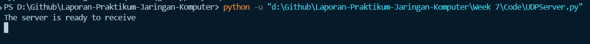

# Tugas Praktikum Week 7 | Modul 7 Socket Programming: Membuat Aplikasi Jaringan

Praktikum week 7 membahas pemrograman socket berbasis UDP dan TCP. Pada modul ini saya membuat aplikasi client-server sederhana untuk melihat perbedaan komunikasi connectionless dan connection-oriented, sekaligus memahami alur kirim-terima pesan pada dua protokol tersebut.

---

## Struktur Folder

1. `Code/` berisi source code `UDPClient.py`, `UDPServer.py`, `tcpClient.py`, dan `tcpServer.py`.
2. `Assets/` berisi screenshot hasil eksekusi program UDP dan TCP.

---

## Tujuan Praktikum

Mahasiswa dapat memahami dasar pemrograman socket menggunakan UDP dan TCP, lalu membandingkan cara kerja keduanya melalui implementasi client-server sederhana.

---

## Pengantar

UDP dan TCP sama-sama digunakan untuk komunikasi jaringan, tetapi karakteristiknya berbeda. UDP lebih sederhana karena tidak perlu membangun koneksi terlebih dahulu, sedangkan TCP harus membentuk koneksi sebelum data dikirim. Pada praktikum ini, saya menguji keduanya menggunakan script Python client-server dan melihat hasilnya melalui terminal.

---

## Penjelasan UDP Client

```python
from socket import *

serverName = 'localhost'
serverPort = 12000

clientSocket = socket(AF_INET, SOCK_DGRAM)

message = input('Input lowercase sentence: ')
clientSocket.sendto(message.encode(), (serverName, serverPort))

modifiedMessage, serverAddress = clientSocket.recvfrom(2048)
print('Reply from Server:', modifiedMessage.decode())

clientSocket.close()
```

Program `UDPClient.py` berfungsi untuk mengirim pesan ke server UDP lalu menerima balasan dari server. Client membuat socket bertipe `SOCK_DGRAM`, mengirim data menggunakan `sendto()`, lalu menunggu response menggunakan `recvfrom()`.

### Penjelasan per potongan kode UDPClient.py:

- Import modul socket:
  ```python
  from socket import *
  ```
  Agar fungsi socket dapat digunakan di Python.

- Menentukan alamat dan port server:
  ```python
  serverName = 'localhost'
  serverPort = 12000
  ```
  Menentukan tujuan komunikasi client.

- Membuat socket UDP:
  ```python
  clientSocket = socket(AF_INET, SOCK_DGRAM)
  ```
  Socket dibuat menggunakan protokol UDP.

- Mengambil input dari user:
  ```python
  message = input('Input lowercase sentence: ')
  ```
  User memasukkan teks yang akan dikirim.

- Mengirim pesan ke server:
  ```python
  clientSocket.sendto(message.encode(), (serverName, serverPort))
  ```
  Pesan dikirim ke server setelah diubah menjadi byte.

- Menerima balasan dari server:
  ```python
  modifiedMessage, serverAddress = clientSocket.recvfrom(2048)
  ```
  Client menerima response dari server.

- Menampilkan balasan:
  ```python
  print('Reply from Server:', modifiedMessage.decode())
  ```
  Balasan server ditampilkan di terminal.

- Menutup socket:
  ```python
  clientSocket.close()
  ```
  Socket ditutup setelah komunikasi selesai.

## Penjelasan UDP Server

```python
from socket import *

serverPort = 12000
serversocket = socket(AF_INET, SOCK_DGRAM)
serversocket.bind(('', serverPort))

print('The server is ready to receive')

while True:
    message, clientAddress = serversocket.recvfrom(2048)
    modifiedMessage = message.decode().upper()
    kata_terbalik = modifiedMessage[::-1]
    serversocket.sendto(kata_terbalik.encode(), clientAddress)
```

Program `UDPServer.py` berfungsi sebagai server UDP yang menerima pesan dari client, mengubahnya menjadi huruf kapital, lalu membalik urutan karakter sebelum mengirim balik hasilnya. Alur ini menunjukkan bahwa server UDP dapat merespons tanpa perlu membangun koneksi khusus.

### Penjelasan per potongan kode UDPServer.py:

- Import modul socket:
  ```python
  from socket import *
  ```

- Menentukan port server:
  ```python
  serverPort = 12000
  ```

- Membuat socket UDP:
  ```python
  serversocket = socket(AF_INET, SOCK_DGRAM)
  ```

- Bind socket ke port:
  ```python
  serversocket.bind(('', serverPort))
  ```
  Socket diikat ke port lokal tertentu.

- Menampilkan status server:
  ```python
  print('The server is ready to receive')
  ```

- Loop penerimaan pesan:
  ```python
  while True:
      message, clientAddress = serversocket.recvfrom(2048)
      modifiedMessage = message.decode().upper()
      kata_terbalik = modifiedMessage[::-1]
      serversocket.sendto(kata_terbalik.encode(), clientAddress)
  ```
  Server menerima data, mengubah teks menjadi kapital, membalik urutan karakter, lalu mengirim balasan ke client.

## Penjelasan TCP Client

```python
from socket import *

serverName = 'Galang-Herjuno'
serverPort = 12000

clientSocket = socket(AF_INET, SOCK_STREAM)

clientSocket.connect((serverName, serverPort))

sentence = input('Input lowercase sentence: ')
clientSocket.send(sentence.encode())

modifiedSentence = clientSocket.recv(1024)
print('From Server:', modifiedSentence.decode())

clientSocket.close()
```

Program `tcpClient.py` berfungsi sebagai client TCP yang terhubung ke server terlebih dahulu sebelum mengirim pesan. Setelah koneksi berhasil, client mengirim pesan dan menerima hasil olahan dari server.

### Penjelasan per potongan kode TCPClient.py:

- Import modul socket:
  ```python
  from socket import *
  ```

- Menentukan alamat server:
  ```python
  serverName = 'Galang-Herjuno'
  serverPort = 12000
  ```

- Membuat socket TCP:
  ```python
  clientSocket = socket(AF_INET, SOCK_STREAM)
  ```

- Membuka koneksi ke server:
  ```python
  clientSocket.connect((serverName, serverPort))
  ```

- Mengambil input pengguna:
  ```python
  sentence = input('Input lowercase sentence: ')
  ```

- Mengirim pesan ke server:
  ```python
  clientSocket.send(sentence.encode())
  ```

- Menerima balasan dari server:
  ```python
  modifiedSentence = clientSocket.recv(1024)
  ```

- Menampilkan balasan:
  ```python
  print('From Server:', modifiedSentence.decode())
  ```

- Menutup socket:
  ```python
  clientSocket.close()
  ```

## Penjelasan TCP Server

```python
from socket import *

serverPort = 12000

serverSocket = socket(AF_INET, SOCK_STREAM)
serverSocket.bind(('', serverPort))
serverSocket.listen(1)
print('The server is ready to receive (TCP Reverse)')

while True:
    connectionSocket, addr = serverSocket.accept()
    sentence = connectionSocket.recv(1024).decode()
    reversedSentence = sentence[::-1]
    connectionSocket.send(reversedSentence.encode())
    connectionSocket.close()
```

Program `tcpServer.py` berfungsi sebagai server TCP yang menerima koneksi dari client, membaca pesan yang dikirimkan, lalu mengembalikan hasil reverse string. Karena TCP bersifat connection-oriented, server harus menerima koneksi terlebih dahulu sebelum pertukaran data dilakukan.

### Penjelasan per potongan kode TCPServer.py:

- Import modul socket:
  ```python
  from socket import *
  ```

- Menentukan port server:
  ```python
  serverPort = 12000
  ```

- Membuat socket TCP:
  ```python
  serverSocket = socket(AF_INET, SOCK_STREAM)
  ```

- Bind socket ke port:
  ```python
  serverSocket.bind(('', serverPort))
  ```

- Mulai listen:
  ```python
  serverSocket.listen(1)
  ```

- Menampilkan status server:
  ```python
  print('The server is ready to receive (TCP Reverse)')
  ```

- Menerima koneksi client:
  ```python
  connectionSocket, addr = serverSocket.accept()
  ```

- Membaca pesan dari client:
  ```python
  sentence = connectionSocket.recv(1024).decode()
  ```

- Membalik string dan mengirim hasil:
  ```python
  reversedSentence = sentence[::-1]
  connectionSocket.send(reversedSentence.encode())
  ```

- Menutup koneksi:
  ```python
  connectionSocket.close()
  ```

---

### Ouput UDP
<br>

### Ouput TCP
<br>

### Tampilan Server
<br>

---

## Kesimpulan

Berdasarkan praktikum ini, saya memahami bahwa UDP cocok untuk komunikasi yang sederhana dan cepat, sedangkan TCP lebih sesuai untuk komunikasi yang membutuhkan koneksi stabil dan terkontrol. Dari implementasi client-server yang dibuat, perbedaan cara kerja kedua protokol dapat terlihat jelas pada proses pengiriman pesan, pembentukan koneksi, dan hasil keluaran di terminal.

## Ends Of File
 [Kembali ke Halaman Utama](../README.md) 
